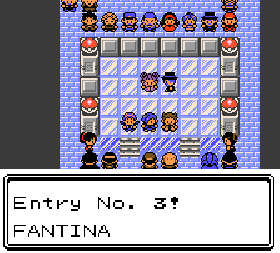
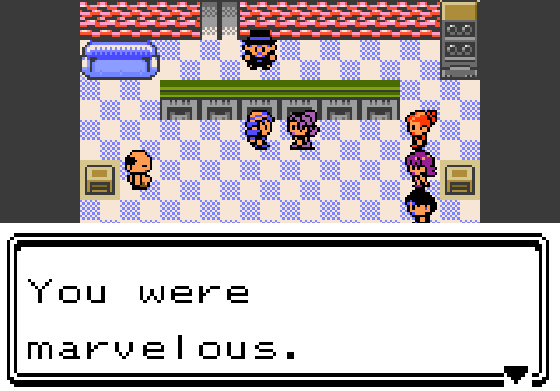
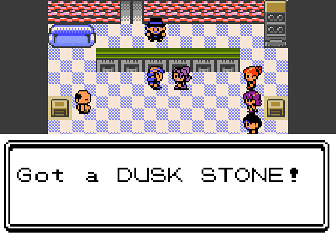

# The MASTER challenge

**This page spoils it.** Stop here if you would rather meet her on the stage.

## Fantina

Hearthome's Gym Leader, Sinnoh's contest star, has come to Johto for the MASTER circuit. She enters your **first MASTER contest, whichever category you pick**, with her Misdreavus, and she is good. Lose or withdraw and she is back next time, in any category, as many times as it takes. The **first MASTER win against her ends her run for that save**: she does not enter again, in any category, and she has something for you.

| | |
|---|---|
|  |  |
|  |  |

After that win she finds you in the lobby, says her piece, hands over **one DUSK STONE**, and walks out through the door. If your bag is full she keeps it: make room and come back to any contest lobby. It is one stone per save, not one per category or per Pokémon. Quest exhibitions that do not record results do not count.

Saves from before this challenge existed start it on their next MASTER contest.

## The Dusk Stone

Use it from the bag like any evolution stone:

- **MURKROW → HONCHKROW**
- **MISDREAVUS → MISMAGIUS**

It runs the normal evolution animation and is consumed only when the evolution completes. An Everstone prevents it. The stone works on either species, so one stone means choosing one Pokémon.

The evolution screen's text pages advance on their own after a moment, without waiting for a button. That is how gen1recomp's Gen 2 evolution animation works for every stone, the Fire Stone included; the Dusk Stone goes through exactly the same path.

## Honchkrow and Mismagius

Both species are bundled with the mod: stats, types, Pokédex entries, party icons, battle sprites, cries (borrowed from Murkrow and Misdreavus) and a move list. No other download or species framework is needed. This is not a dex expansion: only these two evolutions are added, and neither appears in the wild.

The move lists are what the Gen 2 engine can carry, not the complete modern learnsets. Honchkrow knows Pursuit, Haze and Wing Attack at level 1, learns Swagger at 25 and Perish Song at 55. Mismagius knows Shadow Ball, Flamethrower, Growl, Teleport and Confusion at level 1 and learns nothing later. Moves a pre-evolution learns by level are governed by your game's own data, so a Crystal Murkrow still gets Pursuit at 11. On evolving, the game offers only the moves the new form learns at that exact level, as it does for every evolution, so a Honchkrow made at level 30 learns nothing new on the spot.

Their internal ids are `KC_HONCHKROW` and `KC_MISMAGIUS`; the stone is `KC_DUSK_STONE`. Because the mod can add species to a save, it is marked as affecting link compatibility.

## The switches

| Option | Default | Effect |
|---|---|---|
| Dusk Stone reward | On | Award the stone for the first MASTER win against her. Turning it off before that win completes the challenge without a stone. |
| Bundled evolutions | On | Register the two species and the stone evolutions. Turn it off to use another pack's Honchkrow and Mismagius instead, then fully quit and relaunch. |
| Fantina replay | Off | A developer switch for testing and screenshots. She enters every MASTER contest and repeats the gift after each win, one more stone each time. After a gift she stays out of the line-up until you leave the building and come back. |

With **Bundled evolutions off**, the mod adds neither species nor the evolution entries. The Dusk Stone will still evolve a Murkrow or Misdreavus into another pack's Honchkrow or Mismagius if that pack names them uniquely; if no such species exists the stone does nothing and is kept. Turn the reward off too if you do not want the item at all.

**If you already own a Honchkrow or Mismagius from this mod when you switch the species off**, the mod lifts them out of your party, boxes and day-care into a protected store inside the save, with their data and any mail, and tells you so in MODS ERRS. Switch the species back on and they return to where they were, or to the first free slot if that one is taken. They are never converted into another pack's species.

**If you remove the mod entirely**, nothing of it runs, and the engine's own save check takes over: any Pokémon whose species the game no longer knows is set aside in the save's orphan list, with a report on load saying how many. They are not deleted. Reinstall the mod and the engine puts them back on its next load, into the PC boxes rather than the party (if every box is full they wait). The Dusk Stone item is set aside and returned the same way, to the bag or the PC. Do not trade an evolved one to a game that never had the mod.

## Credits

Fantina's overworld walker was commissioned from **Blaklyte** and is the same sheet Indigo Plateau Conference uses, in her approved colours. Honchkrow's and Mismagius's art and data are adapted from **Polished Crystal** by Rangi42 and contributors: Honchkrow by **bloodless (BloodlessNS)**, Mismagius by **bloodless with SoupPotato**. The species registration and save protection adapt **Expanded Species** by Mister Miracle under the MIT licence. Full detail in [THIRD_PARTY_NOTICES.md](../THIRD_PARTY_NOTICES.md).
